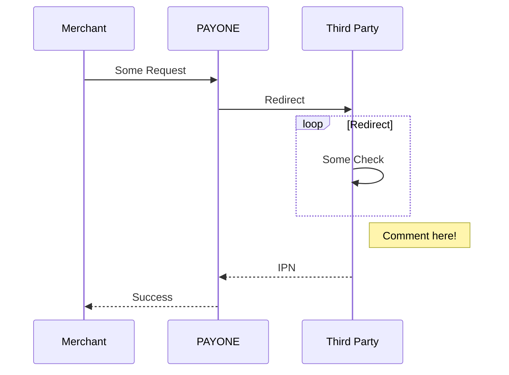

# Examples

## Docusaurus Capabilities
Find the docs here:
https://docusaurus.io/docs/docs-introduction

## Visual Stuff
### Tabs
import Tabs from '@theme/Tabs';
import TabItem from '@theme/TabItem';

<Tabs>
  <TabItem value="apple" label="Apple" default>
    This is an apple 🍎
  </TabItem>
  <TabItem value="orange" label="Orange">
    This is an orange 🍊
  </TabItem>
  <TabItem value="banana" label="Banana">
    This is a banana 🍌
  </TabItem>
</Tabs>

https://docusaurus.io/docs/markdown-features/tabs  

### Code 

```jsx title="/src/components/HelloCodeTitle.js"
function HelloCodeTitle(props) {
  return <h1>Hello, {props.name}</h1>;
}
```

https://docusaurus.io/docs/markdown-features/code-blocks

### Admonitions

:::note

Some **content** with _Markdown_ `syntax`. Check [this `api`](#).

:::

:::tip

Some **content** with _Markdown_ `syntax`. Check [this `api`](#).

:::

:::info

Some **content** with _Markdown_ `syntax`. Check [this `api`](#).

:::

:::caution

Some **content** with _Markdown_ `syntax`. Check [this `api`](#).

:::

:::danger

Some **content** with _Markdown_ `syntax`. Check [this `api`](#).

:::

https://docusaurus.io/docs/markdown-features/admonitions

### Headings and TOC

https://docusaurus.io/docs/markdown-features/toc

### Mermaid

