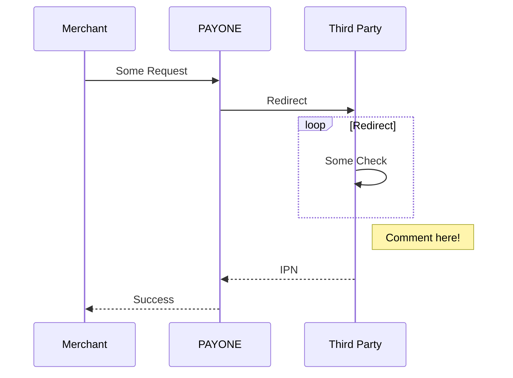

# PAYONE Server API Documentation
This is an example docs page with some demo metadata:
- it's marked as draft and will not show up on deployed sites
- it has some nice SEO-friendly META keywords
- also a nice SEO description
- The title shows up in the sidebar, that is autogenerated based on the folder structure

:::success
also some nicely highlighted text
:::

## Sequence Diagram

## Request types

We structure the docs into these request types:

import DocCardList from '@theme/DocCardList';

<DocCardList />